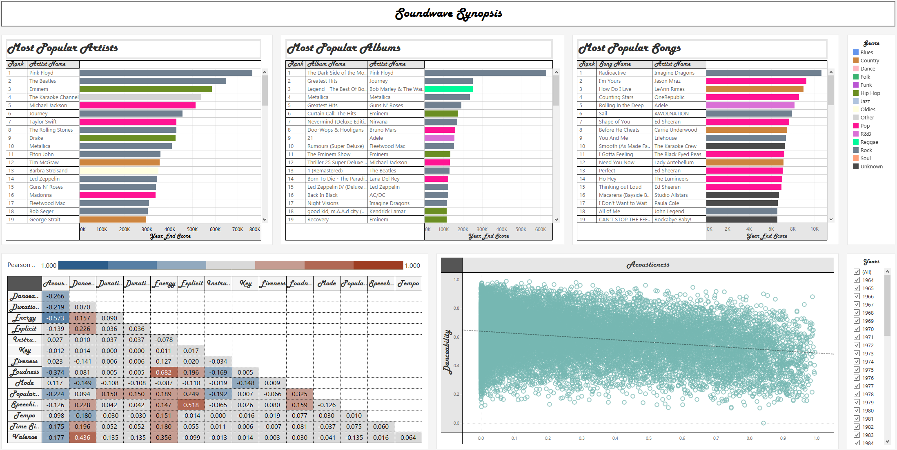
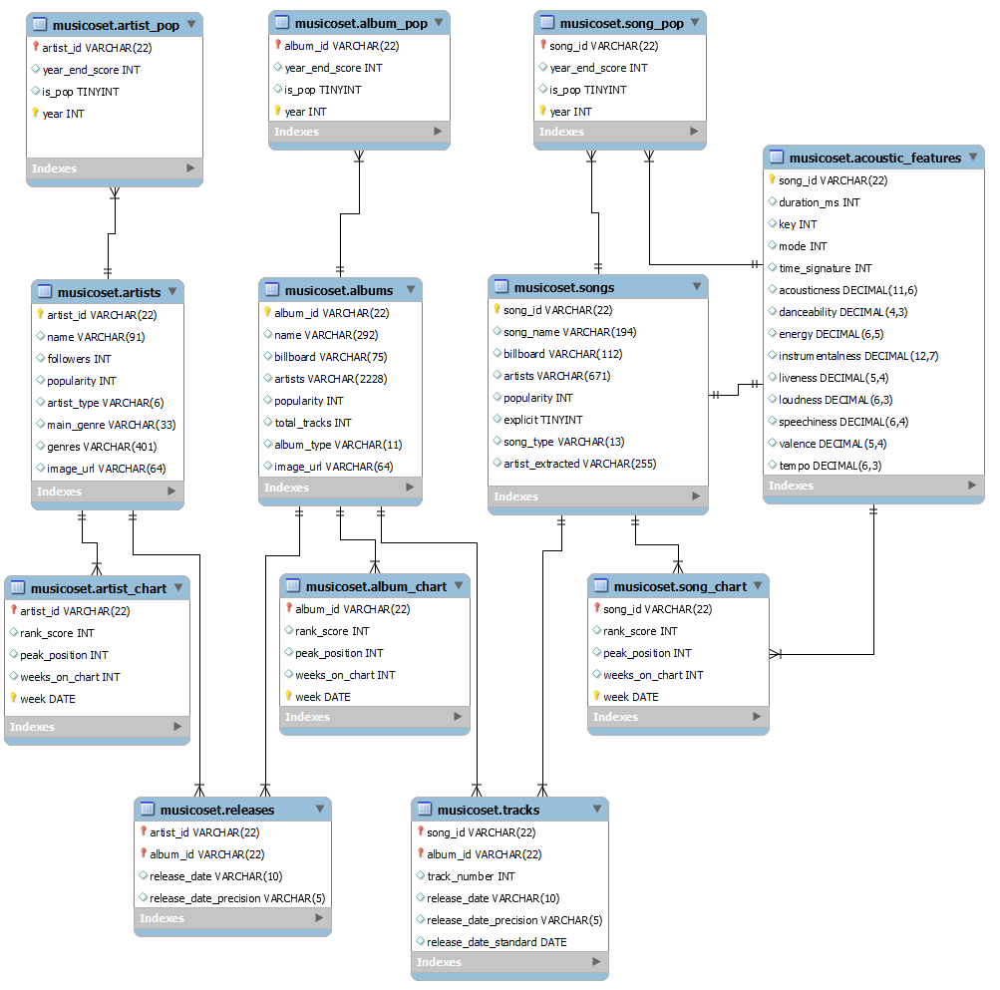
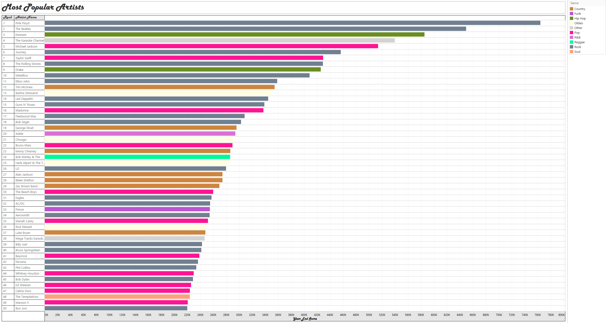
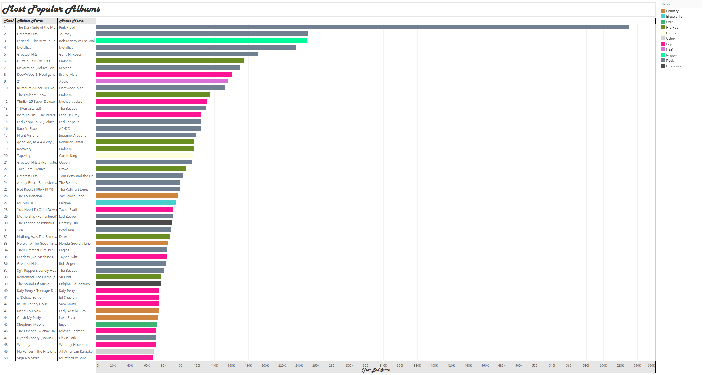
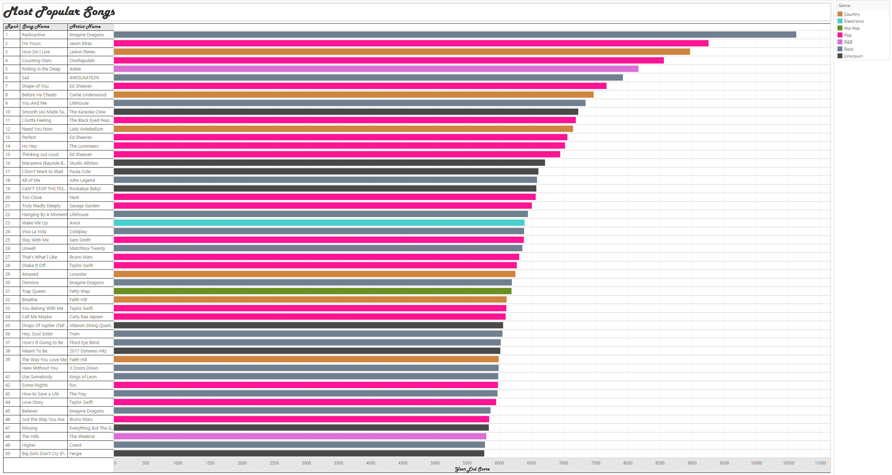
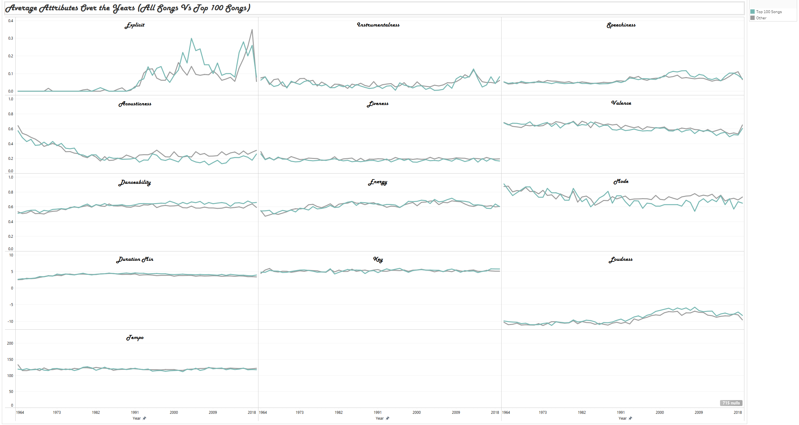
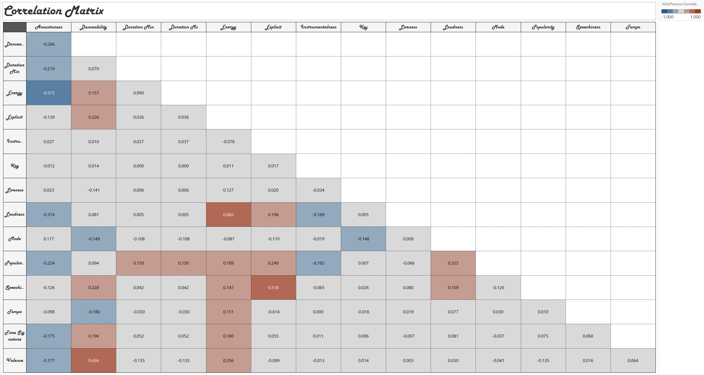

- - -
# Introduction
This analysis explores the evolution of popular music across several decades, using a dataset that combines both Billboard chart data and musical elements from Spotify. The goal is to uncover trends, identify the most influential artists, albums, songs, and examine correlations among musical attributes from 1964 to 2018. Visualizations and a Tableau Dashboard are provided to include an interactive exploration of the findings.

- - -
# Background
Music is an undeniable part of the human experience that not only enriches culture but is an expression of it. Driven by a passion for music and analytics, I was excited to discover a database that has a vast array of music and details the musical elements of each song. This analysis offers a deep dive into the most popular music across different eras, investigating the attributes associated with popularity. We will also examine how music has changed over time, identifying any notable differences between very top of the charts and other hit songs.


### This analysis will answer the following questions:
1. Who are the most prominent artists of all time?
2. Which albums are the most popular of all time?
3. What are the most popular songs of all time?
4. How have musical attributes changed over time?
5. Are there any correlations between different musical elements?

- - -
# Tools 
### Dashboard
The dashboard used in the analysis can be accessed [here](https://public.tableau.com/app/profile/jromiv/viz/SoundwaveSynopsis/Dashboard).


### Technology Stack
- **Excel**: For CSV management and data preparation.
- **Git/GitHub**: For version control and to share my insights.
- **MySQL Workbench**: For database management and queries.
- **Python/R**: To calculate correlations.
- **Tableau**: Leveraged for data visualization.
- **Visual Studio Code**: For file management and running Python/R scripts.

- - -
# Data
### Data source
The data for this analysis was sourced from the [MusicOSet](https://marianaossilva.github.io/DSW2019/) database, which provides a comprehensive dataset of musical elements from 1962 to 2018. It includes but is not limited to artists, songs, and albums based on musical popularity classification. This dataset is particularly suitable for tasks in music data mining, such as data visualization, classification, clustering, and similarity search.

### Data Import and Management
The data was imported using MySQL and managed with MySQL Workbench. The MusicOSet database consists of 12 tables, which were queried to perform the analysis. An indepth description of every table and column can be found in the [metadata ](data/metadata.txt) file.



### Data Cleaning and Preparation
Before diving into the analysis, the data was prepared as follows:

1. **Data Type Conversion**: Adjusted various columns to ensure appropriate data types, such as converting text fields to numeric or boolean values.
2. **Date Normalization**: Standardized date fields to ensure consistency and accuracy across the dataset.
3. **Data Cleaning**: Handled missing values and extracted necessary information to improve data quality and usability.


- - -
# Analysis
To identify the most popular music, I used **Year End Score** instead of **Popularity**, since the latter is based on recent plays and reflects current trends instead of long-term popularity. **Year End Score** is calculated by combining a song's peak chart position and the number of weeks it has spent on the chart. This metric provides a more precise measure of a song's popularity and overall performance. 


### 1. Who are the most prominent artists of all time?
> #### A. Highest Year End Score

``` sql
-- All time top 50 Billboard Artists
WITH cte AS (
SELECT
	DENSE_RANK() OVER(ORDER BY SUM(year_end_score) DESC) AS artist_rank,
	artist_name,
	main_genre,
	SUM(year_end_score) AS total_year_end_score
FROM
	artist_temp
GROUP BY
	artist_name,
	main_genre
)

SELECT
	*
FROM
	cte
WHERE
	artist_rank <= 50;
```

Here is a breakdown of the top 50 highest ranked artists of all time:
- The dominate generes in the top 50 are Rock (38%), Pop (15%), and Country (14%).
- *Pink Floyd* has significant lead in regards to score, even surpassing *The Beatles* by 100,000.
- 50% of the top 10 belong to the rock genre.  
    




> #### B. Longest trending artists
``` sql
-- All time longest trending Billboard Artists 
SELECT
	ROW_NUMBER() OVER (ORDER BY MAX(ac.weeks_on_chart) DESC) AS artist_rank,
	a.name,
	a.main_genre,
	MAX(ac.weeks_on_chart) AS weeks_on_chart,
	MIN(ac.week) AS first_week,
	MAX(ac.week) AS last_week
FROM
	artist_chart ac
LEFT JOIN
	artists a
    ON ac.artist_id = a.artist_id
WHERE
	a.name IS NOT NULL
    AND a.name != 'Various Artists'
GROUP BY
	a.name,
	a.main_genre
ORDER BY
	weeks_on_chart DESC
LIMIT
	50;
```


Key findings from the top 50 longest trending artists chart:
- *The Beatles* lead with an impressive 1355 weeks on the charts, equivalent to over 25 years.
- 60% of the artists in the top 10 have been trending since the 1970's.
- On average, each artist has spent about 544 weeks on the chart, equating to over 10 years of chart presence per artist.

#### All time longest trending Billboard Artists
| Rank | Name                           | Weeks on Chart | First Week | Last Week   |
|------|--------------------------------|----------------|------------|-------------|
| 1    | The Beatles                    | 1355           | 1964-01-18 | 2018-12-29  |
| 2    | Eminem                         | 1125           | 1999-02-27 | 2018-12-29  |
| 3    | Pink Floyd                     | 1074           | 1967-12-02 | 2018-12-29  |
| 4    | Drake                          | 1041           | 2009-05-23 | 2018-12-29  |
| 5    | Prince                         | 868            | 1978-10-28 | 2018-12-29  |
| 6    | Herb Alpert & The Tijuana Brass| 774            | 1965-01-16 | 1984-10-27  |
| 7    | Michael Jackson                | 762            | 1971-10-30 | 2018-12-29  |
| 8    | Taylor Swift                   | 722            | 2006-09-23 | 2018-12-29  |
| 9    | Led Zeppelin                   | 665            | 1969-02-15 | 2018-11-17  |
| 10   | Bruno Mars                     | 663            | 2010-08-07 | 2018-12-29  |

<details>
  <summary>Click to see the remaining artists</summary>

| Rank | Name                           | Weeks on Chart | First Week | Last Week   |
|------|--------------------------------|----------------|------------|-------------|
| 11   | Whitney Houston                | 641            | 1985-03-30 | 2018-07-21  |
| 12   | Metallica                      | 630            | 1984-09-29 | 2018-12-29  |
| 13   | Adele                          | 611            | 2008-06-28 | 2018-12-29  |
| 14   | U2                             | 606            | 1981-03-14 | 2018-03-24  |
| 15   | Ed Sheeran                     | 584            | 2012-06-30 | 2018-12-29  |
| 16   | Guns N' Roses                  | 584            | 1987-08-29 | 2018-12-29  |
| 17   | Bill Cosby                     | 574            | 1964-06-27 | 1983-03-19  |
| 18   | Linkin Park                    | 555            | 1990-10-06 | 2018-11-03  |
| 19   | Bob Marley & The Wailers       | 553            | 1975-05-10 | 2018-12-29  |
| 20   | Zac Brown Band                 | 549            | 2008-10-04 | 2018-12-01  |
| 21   | Journey                        | 543            | 1975-05-03 | 2018-12-29  |
| 22   | Chicago                        | 519            | 1969-05-17 | 2017-01-28  |
| 23   | Imagine Dragons                | 505            | 1979-08-11 | 2018-12-29  |
| 24   | The Police                     | 468            | 1979-02-24 | 2007-10-13  |
| 25   | Blake Shelton                  | 458            | 2001-05-26 | 2018-12-15  |
| 26   | Coldplay                       | 453            | 1969-12-27 | 2018-12-22  |
| 27   | Kendrick Lamar                 | 442            | 2003-03-15 | 2018-12-29  |
| 28   | Fleetwood Mac                  | 431            | 1969-02-08 | 2018-12-29  |
| 29   | Beyoncé                        | 427            | 1973-11-03 | 2018-11-03  |
| 30   | Luke Bryan                     | 426            | 2007-08-18 | 2018-10-27  |
| 31   | The Weeknd                     | 422            | 1983-04-30 | 2018-12-29  |
| 32   | The Rolling Stones             | 420            | 1964-05-02 | 2018-11-17  |
| 33   | Eagles                         | 417            | 1972-06-03 | 2018-12-29  |
| 34   | J. Cole                        | 415            | 2010-10-02 | 2018-12-29  |
| 35   | Phil Collins                   | 413            | 1981-03-14 | 2017-01-28  |
| 36   | Nirvana                        | 410            | 1991-10-12 | 2018-12-29  |
| 37   | Bob Seger                      | 408            | 1968-12-21 | 2018-12-29  |
| 38   | The Monkees                    | 393            | 1966-09-10 | 2016-09-03  |
| 39   | Kanye West                     | 381            | 1970-08-15 | 2018-11-17  |
| 40   | Florida Georgia Line           | 380            | 2012-12-22 | 2018-11-10  |
| 41   | Michael Bublé                  | 377            | 1969-06-14 | 2018-12-29  |
| 42   | Nickelback                     | 368            | 1976-09-25 | 2018-03-10  |
| 43   | Queen                          | 364            | 1974-05-11 | 2018-12-29  |
| 44   | Bruce Springsteen              | 356            | 1975-07-26 | 2018-12-29  |
| 45   | Katy Perry                     | 356            | 1977-10-01 | 2018-02-10  |
| 46   | Mumford & Sons                 | 350            | 2010-03-06 | 2018-12-29  |
| 47   | Kid Rock                       | 345            | 1999-01-16 | 2018-10-27  |
| 48   | Madonna                        | 343            | 1983-09-03 | 2016-09-10  |
| 49   | Michael Bolton                 | 343            | 1983-05-07 | 2017-03-04  |
| 50   | AC/DC                          | 338            | 1977-08-13 | 2018-12-29  |

</details>


### 2. Which albums are the most popular of all time?
> ####  A. Highest Year End Score

```sql
-- All time top 50 Billboard Albums
WITH cte AS(
SELECT
	DENSE_RANK() OVER(ORDER BY SUM(year_end_score) DESC) AS album_rank,
	album_name,
	artist_name,
	main_genre,
	MIN(YEAR(release_date)) AS release_date,
	SUM(year_end_score) AS total_year_end_score
FROM
	temp_albums
GROUP BY
	album_name,
	artist_name,
	main_genre
)

SELECT
	*
FROM
	cte
WHERE
	album_rank <= 50;
```

Key findings for the top 50 albums of all time:
- *The Dark Side of the Moon* is by far the higest ranked album of all time, doubling the number 2 spot *Journey's Greatest Hits*.
- Notably *The Beatles* have 3 albums in the top 50, followed by *Eminem* with 3 albums and *Micheal Jackson* with 2 albums. 
- When combining scores based on artist, *Eminem* would take the #2 spot with a total score of 425,006.
- Although Reggae only appears once, *Legend* by *Bob Marley* holds onto the #3 spot.




> #### B. Longest trending albums
```sql
-- All time longest trending Billboard Albums 
SELECT
	ta.album_name AS album_name,
	ta.artist_name AS artist_name,
	MAX(ac.weeks_on_chart) AS weeks_on_chart,
	MIN(ac.week) AS first_week,
	MAX(ac.week) AS last_week
FROM
	album_chart ac
LEFT JOIN
	temp_albums ta
	ON ac.album_id = ta.album_id
GROUP BY
	album_name,
	artist_name
ORDER BY
	weeks_on_chart DESC
LIMIT
	50;
```

Key findings about the 50 longest trending Billboard albums:
- *The Darkside of the Moon* by *Pink Floyd* trended for a total of 940 weeks. This is equal to about 18 years over the span of 45 years. 
- 52% of the albums on this chart started trending after the year 2000.
- *Greatest Hits* albums from various artists appeared 6 times in the top 50. 
- *Sgt. Pepper's Lonely Hearts Club Band* by *The Beatles* holds the record for the widest span of chart presence.

#### All time longest trending Billboard Albums
|   Rank       | Album                                 | Artist                          |   Weeks on Chart | First Week   | Last Week   |
|-------------:|:--------------------------------------|:--------------------------------|-----------------:|:-------------|:------------|
|            1 | The Dark Side of the Moon             | Pink Floyd                      |              940 | 3/17/1973    | 12/29/2018  |
|            2 | Legend                                | Bob Marley & The Wailers        |              553 | 8/18/1984    | 12/29/2018  |
|            3 | Greatest Hits                         | Journey                         |              543 | 12/3/1988    | 12/29/2018  |
|            4 | Metallica                             | Metallica                       |              514 | 8/31/1991    | 12/29/2018  |
|            5 | Greatest Hits                         | Guns N' Roses                   |              451 | 4/10/2004    | 11/17/2018  |
|            6 | Curtain Call: The Hits                | Eminem                          |              424 | 12/24/2005   | 12/29/2018  |
|            7 | Nevermind (Deluxe Edition)            | Nirvana                         |              404 | 10/12/1991   | 12/29/2018  |
|            8 | Doo-Wops & Hooligans                  | Bruno Mars                      |              402 | 10/23/2010   | 12/1/2018   |
|            9 | 21                                    | Adele                           |              394 | 3/12/2011    | 12/29/2018  |
|           10 | The Eminem Show                       | Eminem                          |              356 | 6/8/2002     | 9/29/2018   |

<details>
  <summary>Click to see the remaining albums </summary>

|   Rank       | Album                                 | Artist                          |   Weeks on Chart | First Week   | Last Week   |
|-------------:|:--------------------------------------|:--------------------------------|-----------------:|:-------------|:------------|
|           11 | 1 (Remastered)                        | The Beatles                     |              347 | 12/2/2000    | 12/29/2018  |
|           12 | Thriller 25 Super Deluxe Edition      | Michael Jackson                 |              346 | 12/25/1982   | 12/29/2018  |
|           13 | Back In Black                         | AC/DC                           |              338 | 8/23/1980    | 12/29/2018  |
|           14 | Night Visions                         | Imagine Dragons                 |              325 | 8/11/1979    | 12/29/2018  |
|           15 | good kid, m.A.A.d city (Deluxe)       | Kendrick Lamar                  |              321 | 11/10/2012   | 12/29/2018  |
|           16 | Recovery                              | Eminem                          |              320 | 7/10/2010    | 11/3/2018   |
|           17 | Greatest Hits II (Remastered)         | Queen                           |              319 | 5/11/1974    | 12/29/2018  |
|           18 | Tapestry                              | Carole King                     |              318 | 4/10/1971    | 4/16/2016   |
|           19 | Born To Die - The Paradise Edition    | Lana Del Rey                    |              314 | 1/28/2012    | 9/29/2018   |
|           20 | Take Care (Deluxe)                    | Drake                           |              303 | 12/3/2011    | 12/29/2018  |
|           21 | Rumours (Super Deluxe)                | Fleetwood Mac                   |              301 | 8/2/1975     | 12/29/2018  |
|           22 | Greatest Hits                         | Tom Petty and the Heartbreakers |              298 | 12/4/1993    | 12/29/2018  |
|           23 | The Foundation                        | Zac Brown Band                  |              289 | 12/6/2008    | 7/9/2016    |
|           24 | Hot Rocks (1964-1971)                 | The Rolling Stones              |              289 | 1/8/1972     | 11/17/2018  |
|           25 | Abbey Road (Remastered)               | The Beatles                     |              288 | 10/18/1969   | 12/29/2018  |
|           26 | MCMXC a.D.                            | Enigma                          |              282 | 3/2/1991     | 10/5/1996   |
|           27 | Led Zeppelin IV (Deluxe Edition)      | Led Zeppelin                    |              281 | 2/15/1969    | 1/30/2016   |
|           28 | You Need To Calm Down                 | Taylor Swift                    |              275 | 11/11/2006   | 2/15/2014   |
|           29 | Mothership (Remastered)               | Led Zeppelin                    |              274 | 12/1/2007    | 11/17/2018  |
|           30 | The Legend of Johnny Cash             | Herthey Hill                    |              269 | 11/12/2005   | 7/29/2017   |
|           31 | Nothing Was The Same (Deluxe)         | Drake                           |              265 | 10/12/2013   | 12/8/2018   |
|           32 | Here's To The Good Times              | Florida Georgia Line            |              261 | 12/22/2012   | 9/15/2018   |
|           33 | Ten                                   | Pearl Jam                       |              261 | 1/4/1992     | 9/17/2016   |
|           34 | The Essential Michael Jackson         | Michael Jackson                 |              256 | 8/6/2005     | 12/29/2018  |
|           35 | Greatest Hits                         | Bob Seger                       |              256 | 11/12/1994   | 12/29/2018  |
|           36 | Fearless (Big Machine Radio Release)  | Taylor Swift                    |              255 | 11/29/2008   | 5/5/2018    |
|           37 | Their Greatest Hits 1971-1975         | Eagles                          |              253 | 3/6/1976     | 12/29/2018  |
|           38 | Remember The Name                     | 50 Cent                         |              243 | 6/30/2012    | 4/7/2018    |
|           39 | Shepherd Moons                        | Enya                            |              238 | 12/7/1991    | 1/11/1997   |
|           40 | The Sound Of Music                    | Original Soundtrack             |              238 | 3/20/1965    | 4/4/2015    |
|           41 | Katy Perry - Teenage Dream            | Katy Perry                      |              236 | 9/11/2010    | 7/22/2017   |
|           42 | In The Lonely Hour                    | Sam Smith                       |              235 | 7/5/2014     | 12/22/2018  |
|           43 | x (Deluxe Edition)                    | Ed Sheeran                      |              235 | 7/12/2014    | 12/29/2018  |
|           44 | Crash My Party                        | Luke Bryan                      |              233 | 8/31/2013    | 9/8/2018    |
|           45 | Hybrid Theory (Bonus Edition)         | Linkin Park                     |              229 | 11/11/2000   | 11/3/2018   |
|           46 | Strummin' On Garth                    | Brooks Jefferson                |              224 | 5/12/1990    | 12/24/1994  |
|           47 | No Fences : The Hits of Garth Brooks  | All American Karaoke            |              224 | 9/22/1990    | 12/31/1994  |
|           48 | Sgt. Pepper's Lonely Hearts Club Band | The Beatles                     |              223 | 6/24/1967    | 12/29/2018  |
|           49 | Sigh No More                          | Mumford & Sons                  |              222 | 3/6/2010     | 7/11/2015   |
|           50 | Number Ones                           | Michael Jackson                 |              222 | 12/6/2003    | 6/2/2018    |

</details>


### 3. What are the most popular songs of all time?
> #### A. Highest Year End Score
```sql
-- All time top 50 Billboard Songs
WITH cte AS(
SELECT
	DENSE_RANK() OVER(ORDER BY SUM(year_end_score) DESC) AS song_rank,
	song_name,
	artist_name,
	main_genre,
	MIN(YEAR(release_date)) AS release_date,
	SUM(year_end_score) AS total_year_end_score
FROM
	temp_songs
GROUP BY
	song_name,
	artist_name,
	main_genre
)
    
SELECT
	*
FROM
	cte
WHERE
	song_rank <= 50;
```

Here is what was found about the top 50 songs of all time:
- Pop is the most represented genre in the top songs, accounting for 34% (17 songs) and Rock with 30% (15 songs).
- The most popular song is *Radioactive* by *Imagine Dragons*, being the only song to surpass 5 digits in score.
- Several artists have multiple appearences: *Imagine Dragons* (3 songs), *Ed Sheeran* (3 songs) and *Taylor Swift* (3 songs). 



> #### B. Longest trending songs
```sql
-- All time longest trending Billboard Songs 
SELECT
	ts.song_name,
	ts.artist_name,
	MAX(sc.weeks_on_chart) AS weeks_on_chart,
	MIN(week) AS first_week,
	MAX(week) AS last_week
FROM
	song_chart sc
LEFT JOIN
	temp_songs ts
	ON ts.song_id = sc.song_id
GROUP BY
	ts.song_name,
	ts.artist_name
ORDER BY
	weeks_on_chart DESC
LIMIT
	100;
```

Here is a breakdown of the top 50 highest ranked artists of all time:
- Only 24% of the longest trending songs are from the 1990's.
- *Wake Me Up* by *Avicii* holds the record for the widest trending timeframe, staying on the charts for relevant for almost 5 years. 
- *Imagine Dragons* have multiple high-performing songs with long chart durations, including *Radioactive* (90 weeks), *Demons* (75 weeks), and *Thunder* (50 weeks).

#### All time longest trending Billboard Songs
| Rank       | song_name                                               | artist_name             | weeks_on_chart | first_week   | last_week   |
|------------|---------------------------------------------------------|-------------------------|----------------|--------------|-------------|
| 1          | Radioactive                                             | Imagine Dragons         | 87             | 2012-08-18   | 2014-05-10  |
| 2          | Sail                                                    | AWOLNATION              | 79             | 2011-09-03   | 2014-03-22  |
| 3          | I'm Yours                                               | Jason Mraz              | 76             | 2008-05-03   | 2009-10-10  |
| 4          | How Do I Live                                           | LeAnn Rimes             | 69             | 1997-06-21   | 1998-10-10  |
| 5          | Counting Stars                                          | OneRepublic             | 68             | 2013-07-06   | 2014-10-18  |
| 6          | Rolling in the Deep                                     | Adele                   | 65             | 2010-12-25   | 2012-04-14  |
| 7          | Before He Cheats                                        | Carrie Underwood        | 64             | 2006-09-16   | 2007-12-01  |
| 8          | You And Me                                              | Lifehouse               | 62             | 2005-02-12   | 2006-04-22  |
| 9          | Ho Hey                                                  | The Lumineers           | 62             | 2012-06-23   | 2013-08-24  |
| 10         | Demons                                                  | Imagine Dragons         | 61             | 2013-01-26   | 2014-07-05  |

<details>
  <summary>Click to see the remaining songs</summary>


| Rank       | song_name                                               | artist_name             | weeks_on_chart | first_week   | last_week   |
|------------|---------------------------------------------------------|-------------------------|----------------|--------------|-------------|
| 11         | Need You Now                                            | Lady Antebellum         | 60             | 2009-08-29   | 2010-10-16  |
| 12         | Macarena (Bayside Boys Mix)                             | Studio Allstars         | 60             | 1995-08-03   | 1997-02-22  |
| 13         | Baby Got Back                                           | Sir Mix-A-Lot           | 56             | 1992-05-02   | 1993-07-17  |
| 14         | How You Remind Me                                       | Nickelback              | 54             | 2001-08-18   | 2003-09-08  |
| 15         | Sugar, We're Goin Down                                  | Fall Out Boy            | 54             | 2005-06-04   | 2006-12-30  |
| 16         | Hey, Soul Sister                                        | Train                   | 54             | 2009-10-17   | 2011-04-02  |
| 17         | Take Me To Church                                       | Hozier                  | 53             | 2014-06-21   | 2015-09-26  |
| 18         | Hanging By A Moment                                     | Lifehouse               | 53             | 2000-12-30   | 2002-11-23  |
| 19         | Love Story                                              | Taylor Swift            | 53             | 2008-09-27   | 2009-12-05  |
| 20         | Dynamite                                                | Taio Cruz               | 53             | 2010-05-15   | 2011-09-24  |
| 21         | I Gotta Feeling                                         | Black Eyed Peas         | 53             | 2009-06-27   | 2010-06-26  |
| 22         | Not Afraid                                              | Eminem                  | 53             | 2010-05-22   | 2011-05-21  |
| 23         | Closer                                                  | The Chainsmokers        | 53             | 2016-08-20   | 2017-08-19  |
| 24         | Somebody That I Used To Know                            | Gotye                   | 53             | 2011-11-19   | 2013-11-10  |
| 25         | Lights                                                  | Ellie Goulding          | 53             | 2011-09-24   | 2013-09-14  |
| 26         | Blurred Lines                                           | Robin Thicke            | 53             | 2013-03-30   | 2014-03-29  |
| 27         | Here Without You                                        | 3 Doors Down            | 53             | 2003-05-31   | 2004-05-29  |
| 28         | We Belong Together                                      | Mariah Carey            | 53             | 2005-03-26   | 2006-03-25  |
| 29         | Low                                                     | Flo Rida                | 53             | 2007-10-06   | 2008-10-04  |
| 30         | See You Again                                           | Wiz Khalifa             | 53             | 2015-04-25   | 2016-04-23  |
| 31         | We Are Young                                            | fun.                    | 53             | 2011-12-10   | 2013-12-01  |
| 32         | Uptown Funk                                             | Mark Ronson             | 53             | 2014-11-08   | 2016-11-07  |
| 33         | Bad Day                                                 | Daniel Powter           | 53             | 2005-12-03   | 2007-11-17  |
| 34         | Don't Speak                                             | No Doubt                | 53             | 1996-08-10   | 1998-08-15  |
| 35         | Whoomp! There It Is                                     | Tag Team                | 53             | 1993-05-29   | 1995-05-20  |
| 36         | It Wasn't Me                                            | Shaggy                  | 53             | 2000-08-19   | 2002-08-03  |
| 37         | Kryptonite                                              | 3 Doors Down            | 53             | 2000-04-08   | 2001-04-07  |
| 38         | If I Die Young                                          | The Band Perry          | 53             | 2010-07-24   | 2011-12-10  |
| 39         | Shut Up and Dance                                       | WALK THE MOON           | 53             | 2014-11-22   | 2015-11-28  |
| 40         | Thunder                                                 | Imagine Dragons         | 52             | 2017-05-20   | 2018-05-05  |
| 41         | How's It Going to Be                                    | Third Eye Blind         | 52             | 1997-12-06   | 1998-11-28  |
| 42         | Meant To Be                                             | 2017 Dynamo Hitz        | 52             | 2017-11-11   | 2018-10-27  |
| 43         | CAN’T STOP THE FEELING!                                 | Rockabye Baby!          | 52             | 2016-05-28   | 2017-05-20  |
| 44         | That's What I Like                                      | Bruno Mars              | 52             | 2016-12-10   | 2018-01-20  |
| 45         | Say You Won't Let Go                                    | James Arthur            | 52             | 2016-11-12   | 2017-11-04  |
| 46         | Stitches                                                | Shawn Mendes            | 52             | 2015-06-13   | 2016-06-04  |
| 47         | Truly Madly Deeply                                      | Savage Garden           | 52             | 1997-12-06   | 1998-11-28  |
| 48         | Believer                                                | Imagine Dragons         | 52             | 2017-02-25   | 2018-02-10  |
| 49         | Stressed Out                                            | Twenty One Pilots       | 52             | 2015-05-16   | 2016-10-01  |
| 50         | Trap Queen                                              | Fetty Wap               | 52             | 2015-02-07   | 2016-01-30  |

</details>


### 4. How have musical attributes changed over time?
```sql
-- Acoustic Features of the top 100 songs from 1964-2019
WITH cte AS(
SELECT
	RANK() OVER(PARTITION BY YEAR(t.release_date_standard) ORDER BY SUM(sp.year_end_score) DESC) AS song_rank,
	sp.song_id AS id,
	YEAR(t.release_date_standard) AS release_date_standard,
	s.explicit,
	SUM(sp.year_end_score) AS total_year_end_score
FROM
	song_pop sp
LEFT JOIN
	tracks t
    ON t.song_id = sp.song_id
LEFT JOIN
	songs s
    ON sp.song_id = s.song_id
GROUP BY
	sp.song_id,
	YEAR(t.release_date_standard),
	s.explicit
)
SELECT
	song_rank,
	release_date_standard,
	explicit,
	ac.*,
	ac.duration_ms/60000 AS duration_min
FROM
	cte
LEFT JOIN
	acoustic_features ac
    ON ac.song_id = cte.id
WHERE
	song_rank <= 100
    AND release_date_standard >= 1964;
```
Here is a breakdown of the findings:
- There has been a general upward trend towards more explicit music since the 1990's. With the top 100 containing more explicit music than the rest of the charts from 2001-2016.
- The relative loudness of a song has been steadily increasing since 1986. On average, songs in the top 100 are also louder when compared to the rest of the charts.
- There is a downward trend in acousticness, suggesting that modern songs are less likely to be acoustic compared to older songs. When comparing the top 100 songs to the rest of the charts, top 100 songs tend to be less acoustic.
- In 2013 there was a notable peak of instrumental songs released.
- The average duration of songs (2.96 mins) were lower in the 1960's than the rest of the decades (4.14 mins).




### 5. Are there any correlations between different musical elements?

#### Correlation Calculation
Python
```python
import pandas as pd

# import data
temp_attributes = pd.read_csv('temp_attributes.csv')

# create a correlation matrix
numeric_attributes = temp_attributes.drop(columns = ['song_name', 'song_type', 'release_date_standard', 'song_id'])
correlations = numeric_attributes.corr(method = 'pearson')

# export csv
correlations.to_csv('correlations.csv')
```

<details>
<summary>R</summary>

```r
library(dplyr)

# import data
temp_attributes <- read.csv("temp_attributes.csv")

# create a correlation matrix
numeric_attributes <- select(temp_attributes, -song_name, -song_type, -release_date_standard, -song_id)
correlations <- cor(numeric_attributes, use = "everything", method = "pearson")

# export csv
write.csv(correlations,"correlations.csv")
```
</details>

Here are the key findings, in general there are weak to moderate correlations within the attribute data:
- Populartiy is positively correlated with explicit (0.249) and energy (0.189), suggesting that popular songs tend to be more explicit and energetic.
- Popularity is negatively correlated with acousticness (-0.224) and instrumentalness (-0.192), indicating that popular songs are less likely to be acoustic and instrumental.
- Valence positively correlated with danceability (0.436), indicating that positive songs are more danceable.
- Acousticness also negatively correlated with Energy (-0.573) indicating  that acoustic songs tend to have less energy. This may be noteworthy since these attributes also show a negative/positive relationship with popularity. 




- - -
# Conclusions

### Insights
In this analysis of popular music spanning from the 1960s to 2018, some noteworthy insights have been discovered:
1. **Genre Dominance**: It's clear that Pop and Rock dominate the top songs and albums charts. However, this dominance is primarily observed in the "All Time" charts. For example in 2018, a clear change in trend has emerged with Hip Hop dominating the charts, this can be explored using the dashboard.
2. **Enduring Popularity**: Certain artists and albums have shown lasting relevace across multiple generations. Artists like *The Beatles*, *Eminem*, and *Pink Floyd* have maintained their popularity as evidenced by their high Year End Scores and prolonged chart presence.
3. **Evolution of Musical Attributes**: Over time, there has been a significant rise in explicit lyrics and loudness in popular music, while acousticness has seen a decline. These trends suggest a shift towards more energetic and bold musical expressions in recent years.
4. **Correlation of Attributes**: Popularity in music is influenced by various attributes, with explicit and energetic songs tending to perform better. Conversely, acoustic and instrumental tracks are less likely to be popular.
5. **Modern Impact**: Recent hits by artists like *Ed Sheeran*, *Imagine Dragons*, and *Avicii* have demonstrated significant chart presence and popularity. The top songs reveal a bias towards more modern music on the Billboard charts.

### Closing Thoughts
Through my findings, I discovered detailed insights and enhanced my understanding of popular musical trends. I also gained a deeper appreciation for musical analysis and the potential for further exploration. In the future, it would be worthwhile to investigate how these trends differ by geographic location. Expanding the database via the Spotify API could provide a deeper dive into what makes music popular and enduring across different regions within the industry as a whole.
