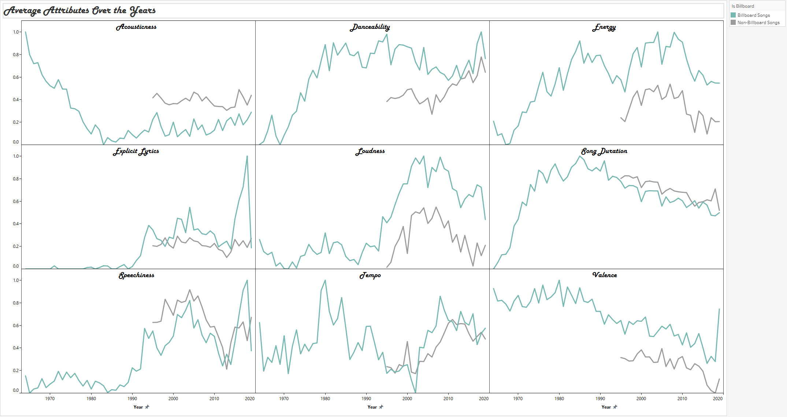
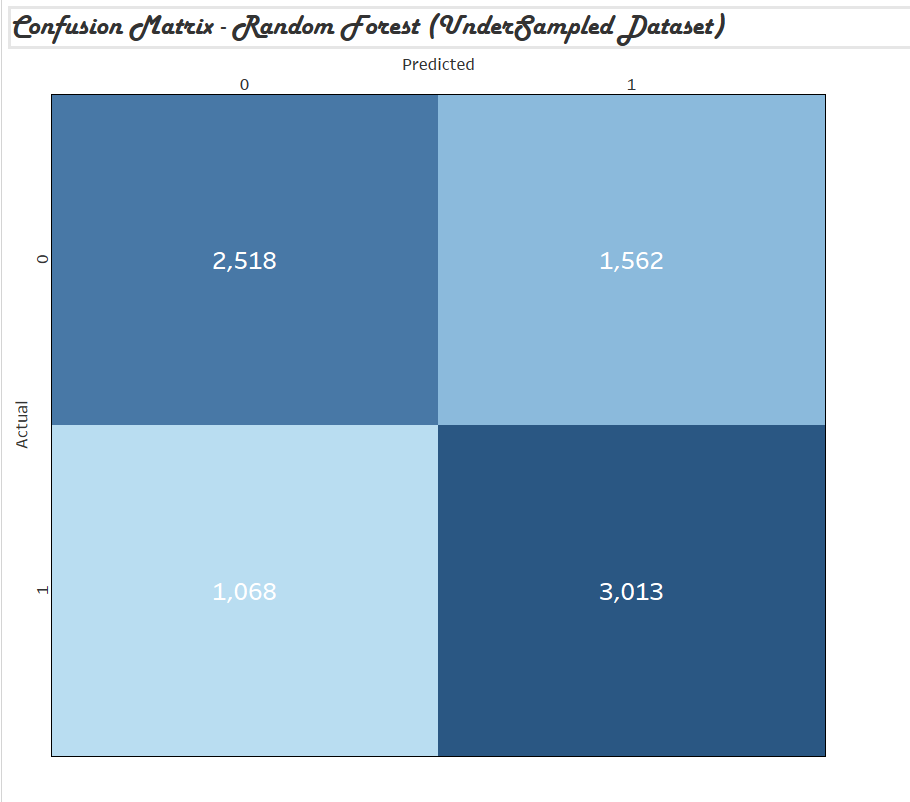

# Introduction
This analysis explores the evolution and patterns of popular music from 1964 to 2018, combining Billboard chart performance with Spotify musical attributes. The project looks closely at artist, album, and song success, how acoustic features have shifted over time, and whether certain musical traits are tied to popularity. 

The goal is to better understand what makes a song popular and whether it’s possible to predict a Billboard hit using machine learning. Visualizations and a Tableau Dashboard are provided for an interactive exploration of the findings.

### This analysis explores the following questions:
1. Who are the top Billboard artists, albums, and songs of all time?
2. Which genres have dominated the Billboard charts over time?
3. How have musical attributes evolved from the 1960s to today?
4. Can we predict whether a song becomes a Billboard hit using its audio features?


# Tools 
### Dashboard
The dashboard used in the analysis can be accessed [here](https://public.tableau.com/app/profile/jromiv/viz/soundwave_synopsis/Dashboard).


### Technology Stack
- **Excel** – CSV management and light data cleaning.
- **Git/GitHub** – Version control and sharing insights.
- **MySQL Workbench** – Database setup, exploration, and SQL queries.
- **Python** – Lyrical analysis and machine learning (Random Forest, XGBoost).
- **Tableau** – Data visualization and dashboard creation.
- **Visual Studio Code** – Script creation and project organization.


# Data
### Data source
The data for this analysis was sourced from the [MusicOSet](https://marianaossilva.github.io/DSW2019/) database, which provides a large dataset of Billboard charts from 1962 to 2018. It includes but is not limited to artists, songs, and albums based on musical popularity classification. This dataset is particularly suitable for tasks in music data mining, such as data visualization, classification, clustering, and similarity search.

### Data Import and Management
The data was imported using MySQL and managed with MySQL Workbench. The MusicOSet database consists of 13 tables, which were queried to perform the analysis. An indepth description of every table and column can be found in the [metadata ](data/metadata.txt) file.


### Data Cleaning and Preparation  
To prepare the dataset for analysis and modeling, I did several data cleaning steps in SQL:

1. **Data Normalization** – Converted columns like `explicit`, `is_pop`, and `followers` from text (e.g., `'True'`, `'None'`) into numeric or boolean formats.
2. **Date Standardization** – Cleaned and reformatted inconsistent `release_date` fields, adding a new `release_date_standard` column to handle partial dates (e.g., only year or month-year).
3. **Schema Refinement** – Created new columns (e.g., `artist_extracted`) to extracted primary artist names from the nested strings.
4. **Data Imports** – Loaded data from multiple CSVs (including Billboard and non-Billboard songs) into MySQL using `LOAD DATA INFILE`, handling both tab and comma-delimited formats.
5. **Table Creation** – Defined a relational schema across 13 tables using appropriate primary keys, foreign keys, and data types to ensure accuracy.

Some of the SQL work used to clean and structure the database can be found in the [`/sql_load`](sql_load) folder.


# Analysis
To measure music success, I used **Year End Score** instead of Spotify’s **Popularity** measure. Popularity reflects current plays and trends, while **Year End Score** captures a more long-term measure on the Billboard charts.

**Year End Score** is calculated using a song’s peak chart position and the total number of weeks it remained on the chart. This gives a better picture of a song's performance over time.


## 1. Who are the top Billboard artists, albums, and songs of all time?

To measure long-term success, I ranked artists, albums, and songs using **Year End Score**, which combines chart position and time spent on the Billboard charts.

#### Top Artists


**Insight:** *Pink Floyd* ranks #1, outperforming *The Beatles* by over 100,000 points, with Rock (as a genre) dominating the top 25 artist list.

<details>
<summary>SQL Query (click to expand)</summary>

```sql
-- All time top 25 Billboard artists (using year end score)
WITH cte AS (
SELECT
    DENSE_RANK() OVER(ORDER BY SUM(apop.year_end_score) DESC) AS artist_rank,
    a.artist_id,
    a.artist_name,
    a.main_genre,
    SUM(apop.year_end_score) AS total_year_end_score
FROM
    artist_pop apop
INNER JOIN
	artists a
    ON apop.artist_id = a.artist_id
WHERE
	a.artist_name != 'Various Artists' 
GROUP BY
	a.artist_id,
    a.artist_name,
    a.main_genre
)
SELECT
	*
FROM
	cte
WHERE
	artist_rank <= 25;
```
</details>

---
#### Top Albums


**Insight:** *The Dark Side of the Moon* has the highest score by far, more than doubling the next highest album, *Journey’s Greatest Hits*. Rock continues to dominate, making up 52% of the top 25 albums.

<details>
<summary>SQL Query (click to expand)</summary>

```sql
-- All time top 25 Billboard albums (using year end score)
WITH cte AS (
    SELECT
        DENSE_RANK() OVER(ORDER BY SUM(apop.year_end_score) DESC) AS album_rank,
        alb.album_id,
        alb.album_name,
        a.artist_name,
        a.main_genre,
        SUM(apop.year_end_score) AS total_year_end_score
    FROM
        album_pop apop
    INNER JOIN 
		albums alb 
        ON apop.album_id = alb.album_id
    LEFT JOIN 
		artists a 
        ON alb.artist_id = a.artist_id
    GROUP BY 
		alb.album_id, alb.album_name, a.artist_name, a.main_genre
)
SELECT 
	* 
FROM 
	cte
WHERE 
	album_rank <= 25;
```
</details>

---

#### Top Songs


**Insight:** *Radioactive* by *Imagine Dragons* is the top-performing song of all time (as of 2018) and the only one to break 10,000 in Year End Score. Newer songs make up most of the top 25, with Pop being the most common genre at 36%.   

<details>
<summary>SQL Query (click to expand)</summary>

```sql
-- All time top 25 Billboard songs (using year end score)
WITH cte AS (
    SELECT
        DENSE_RANK() OVER(ORDER BY SUM(spop.year_end_score) DESC) AS song_rank,
        s.song_id,
        s.song_name,
        a.artist_name,
        a.main_genre,
        SUM(spop.year_end_score) AS total_year_end_score
    FROM
        song_pop spop
    INNER JOIN 
		songs s 
        ON s.song_id = spop.song_id
    LEFT JOIN 
		artists a 
        ON a.artist_id = s.artist_id 
    GROUP BY 
		s.song_id, s.song_name, a.artist_id, a.artist_name, a.main_genre
)
SELECT 
	* 
FROM 
	cte
WHERE 
	song_rank <= 25;
```
</details>


## 2. Which genres have dominated the Billboard charts over time?

To understand changes in musical taste, I used the summation of the genres **Year End Score**  (year over year). The line chart below focuses on the four most influential genres: **Rock**, **Pop**, **Hip Hop**, and **Country & Folk**. ALthough **Jazz** was a the 5th largest genre, I cut it for the sake of image clarity. Further exploration can be accessed where the dashboard is avaialble.

To get a sense of how musical tastes have shifted, I summed the **Year End Score** by genre for each year. The line chart below highlights the four most influential genres: **Rock**, **Pop**, **Hip Hop**, and **Country & Folk**. While **Jazz** ranked fifth overall, I left it out here to keep the image from getting too cluttered. You can explore all genres in more detail through the dashboard mentioned above.


**Insight:** Rock was dominant from the 1960s through the 1990s, but Hip Hop has seen a sharp rise since the 2000s, securing 2nd place by 2018.

<details>
<summary>SQL Query (click to expand)</summary>

```sql
-- Most popular genres year over year (year end score)
SELECT 
    sp.year,
    a.main_genre, 
    SUM(sp.year_end_score) AS total_score
FROM 
    song_pop sp
INNER JOIN 
    songs s 
    ON sp.song_id = s.song_id
INNER JOIN 
    artists a 
    ON s.artist_id = a.artist_id
WHERE 
    a.main_genre IS NOT NULL
GROUP BY 
    sp.year, 
    a.main_genre
ORDER BY 
    sp.year,
    total_score DESC;
```
</details>


## 3. How have musical attributes evolved from the 1960s to today?

To dive a bit deeper into how music has changed over time, I also calculated the yearly averages for several musical attributes (e.g., energy, valence, loudness) grouped by Billboard and non-Billboard songs. The trellis chart below, illustrates the 9 acoustic features from 1964 onward.




**Note**: non-hit songs appear from the 1990s onward.

**Insight:** Songs have gradually become louder and more explicit since the 1990s. Acousticness has plummeted, especially with Billboard hits, while danceability and energy have been somewhat stable since the 80's. The differences between billboard hits and non-hits are also noteworthy, hit songs tend to be more danceable, more energetic, louder, and less acoustic.


<details>
<summary>SQL Query (click to expand)</summary>

```sql
-- Billboard vs non-hits year over year
SELECT 
    YEAR(t.release_date_standard) AS year,
    s.is_billboard,
    AVG(ac.danceability) AS avg_danceability,
    AVG(ac.energy) AS avg_energy,
    AVG(ac.valence) AS avg_valence,
    AVG(ac.tempo) AS avg_tempo,
    AVG(ac.speechiness) AS avg_speechiness,
    AVG(ac.acousticness) AS avg_acousticness,
    AVG(ac.loudness) AS avg_loudness,
    AVG(ac.duration_ms) / 60000 AS avg_duration_min,
    AVG(s.explicit) * 100 AS explicit_percentage,
    COUNT(s.song_id) AS total_songs
FROM 
	songs s
INNER JOIN 
	tracks t 
    ON s.song_id = t.song_id
INNER JOIN 
	acoustic_features ac 
    ON s.song_id = ac.song_id
WHERE 
	YEAR(t.release_date_standard) >= 1964
GROUP BY 
	YEAR(t.release_date_standard), is_billboard
ORDER BY 
	year ASC, is_billboard DESC;
```    
</details>


## 4. Can we predict whether a song becomes a Billboard hit using its audio features?

To explore this, I used classification models to predict whether a song was a Billboard hit based on attrubutes like tempo, energy, and whether the song was explicit or a collaboration. I used two models, **Random Forest** and **XGBoost** and tried different ways of balancing the data to see what worked best.

Only about 2% of the songs in the dataset were Billboard hits, so the data was very imbalanced. To deal with this, I created three different versions of the dataset:
- **Complete Dataset** – all songs (very imbalanced)
- **1:1 Undersampled Dataset** – an even split between hits and non-hits
- **Hybrid Dataset** – a mix of under-sampling and SMOTE to keep more data while still improving balance


### Focus of the Evaluation

I focused on the **F1-score**, which combines precision and recall, because it gave me a clearer picture of how well the models were actually finding Billboard hits.

---

### Data Used

The dataset used for this part of the analysis can be found [here](analysis/5_ml_models/all_songsml.csv). The model used the following features:

`acousticness`, `danceability`, `energy`, `instrumentalness`, `liveness`, `loudness`, `speechiness`, `valence`, `tempo`, `explicit`, and `is_collaboration`.


While tuning the parameters helped a bit, I actually saw the most improvement by modifying the dataset itself. Here’s a quick breakdown of how many songs were in each version of the dataset:

| Dataset              | Non-Hits | Billboard Hits | Total     |
|----------------------|----------|----------------|-----------|
| Complete             | 894,392  | 20,402         | 914,794   |
| 1:1 Undersampled     | 20,402   | 20,402         | 40,804    |
| Hybrid (2:1 ratio)   | 81,608   | 40,804         | 122,412   |

---

### Preprocessing

- Dropped missing values from the dataset
- Selected the features listed above
- Created input features and target labels
- Created variations of the dataset
- Split each dataset into training and testing (80/20)


<details>
<summary>Python Code (click to expand)</summary>


```python
# Load dataset
df = pd.read_csv("all_songsml.csv")

# Drop rows with missing values
df = df.dropna()

# Select features and target
X = df[['acousticness', 'danceability', 'energy', 'instrumentalness',
        'liveness', 'loudness', 'speechiness', 'valence', 'tempo', 
        'explicit', 'is_collaboration']]
y = df['is_billboard']

# Create a copy of the original data (no balancing applied)
X_complete = X
y_complete = y

# 1:1 Undersampled Dataset (equal number of hits and non-hits)
rus = RandomUnderSampler(sampling_strategy=1.0, random_state=21)
X_undersampled, y_undersampled = rus.fit_resample(X, y)

# Hybrid Dataset (uses both undersampling and SMOTE for balance)
# Step 1: Undersample majority class to get 1:4 ratio
rus_hybrid = RandomUnderSampler(sampling_strategy=0.25, random_state=21)
X_hybrid_under, y_hybrid_under = rus_hybrid.fit_resample(X, y)

# Step 2: Use SMOTE to oversample minority class to 1:2 ratio
smote = SMOTE(sampling_strategy=0.5, random_state=21)
X_hybrid, y_hybrid = smote.fit_resample(X_hybrid_under, y_hybrid_under)

# Split each dataset into training and testing sets (80/20 split)
X_train_complete, X_test_complete, y_train_complete, y_test_complete = train_test_split(
    X_complete, y_complete, test_size=0.2, random_state=21, stratify=y_complete)

X_train_undersampled, X_test_undersampled, y_train_undersampled, y_test_undersampled = train_test_split(
    X_undersampled, y_undersampled, test_size=0.2, random_state=21, stratify=y_undersampled)

X_train_hybrid, X_test_hybrid, y_train_hybrid, y_test_hybrid = train_test_split(
    X_hybrid, y_hybrid, test_size=0.2, random_state=21, stratify=y_hybrid)
```

</details>


---

### Model Results

Here are the best model performances ranked by their F1-score on the Billboard class:

| Dataset              | Model             | F1 (Billboard) | Precision | Recall |
|----------------------|-------------------|----------------|-----------|--------|
| 1:1 Undersampled     | Random Forest      | **0.70**       | 0.66      | 0.74   |
| Hybrid (2:1)         | XGBoost (opt.)     | 0.67           | 0.67      | 0.68   |
| 1:1 Undersampled     | XGBoost (opt.)     | 0.68           | 0.65      | 0.70   |
| Complete             | XGBoost (opt.)     | 0.03           | 0.06      | 0.02   |

**Takeaway:**  
- The full dataset didn’t perform well because of the imbalance, most hits were missed entirely for all models.
- The 50/50 undersampled dataset worked best for **Random Forest**, but meant we had to throw out a lot of data.
- The hybrid dataset gave a nice middle ground for **XGBoost** with more data, decent balance, and consistent results.

---

### Confusion Matrices

#### Random Forest (1:1 Undersampled Dataset)


**Interpretation:**  
Out of 4,081 Billboard hits, the model correctly predicted 3,013 and missed 1,068. It also incorrectly flagged 1,562 non-hits as hits, but overall did a good job identifying true hits from the undersampled balanced dataset.


<details>
<summary>Python Code (click to expand)</summary>


```python
# Confusion matrix for Random Forest (1:1 Undersampled)
ConfusionMatrixDisplay.from_estimator(rf_undersampled, X_test_undersampled, y_test_undersampled)
plt.title("Random Forest Confusion Matrix (1:1 Undersampled)")
plt.show()
```

</details>


#### XGBoost (Hybrid Dataset)


**Interpretation:**  
Out of 8,161 Billboard hits, the model correctly predicted 5,517 and missed 2,644. It also incorrectly flagged 2,773 non-hits as hits, showing a strong consistency without sacrificing as much data.


<details>
<summary>Python Code (click to expand)</summary>


```python
# Confusion matrix for XGBoost (Hybrid Dataset)
ConfusionMatrixDisplay.from_estimator(xgb_hybrid_opt, X_test_hybrid, y_test_hybrid)
plt.title("XGBoost Confusion Matrix (Hybrid Dataset)")
plt.show()
```

</details>


---

### Feature Importance

#### Random Forest (1:1 Undersampled Dataset)


**Random Forest** leaned more on the musical structure—things like `energy`, `valence`, `acousticness`, and `loudness`.


<details>
<summary>Python Code (click to expand)</summary>


```python
# Feature importance for Random Forest (1:1 Undersampled)
importance = rf_undersampled.feature_importances_
feature_names = X_train_undersampled.columns

feature_importance_df = pd.DataFrame({"Feature": feature_names, "Importance": importance})
feature_importance_df.sort_values(by="Importance", ascending=False, inplace=True)

# Bar chart
feature_importance_df.plot(kind="barh", x="Feature", y="Importance", legend=False, title="Feature Importance")
plt.show()
```

</details>


#### XGBoost (Hybrid Dataset)


**XGBoost** focused more on `instrumentalness`, `is_collaboration`, and `explicit`, meaning songs with those features had more weight in its predictions.


<details>
<summary>Python Code (click to expand)</summary>


```python
# Feature importance for XGBoost (Hybrid Dataset)
importance = xgb_hybrid_opt.feature_importances_
feature_names = X_train_hybrid.columns

feature_importance_df = pd.DataFrame({"Feature": feature_names, "Importance": importance})
feature_importance_df.sort_values(by="Importance", ascending=False, inplace=True)

# Bar chart
feature_importance_df.plot(kind="barh", x="Feature", y="Importance", legend=False, title="Feature Importance")
plt.show()
```

</details>


**Takeaway:**  
It was interesting to see that each model had a different idea of what mattered most. But both agreed that `instrumentalness` was one of the biggest indicators.

---

### Final Model Comparison

The chart below compares the two best-performing models side by side:


<details>
<summary>Python Code (click to expand)</summary>

```python
# Defining values
labels = ['Precision', 'Recall', 'F1-Score']
rf_values = [0.66, 0.74, 0.70]
xgb_values = [0.67, 0.68, 0.67]

# Create a simple grouped bar chart using positions [0, 1, 2]
x = [0, 1, 2]
width = 0.35

# Shift bars slightly for comparison
plt.bar([i - width/2 for i in x], rf_values, width, label='Random Forest')
plt.bar([i + width/2 for i in x], xgb_values, width, label='XGBoost')

plt.xlabel('Metrics')
plt.ylabel('Scores')
plt.title('Model Comparison')
plt.xticks(x, labels)
plt.legend()
plt.show()
```

</details>


**Final Thought:**  The Random Forest model had the best F1-score, but XGBoost was more consistent and better with the larger hybrid dataset.


## Conclusion


This project gave me a chance to explore what makes music popular by looking at Billboard charts, song attributes, and trends over time. Here are a few quick takeaways:

- **Rock and Jazz used to rule the charts**, but lately Hip Hop and Pop have taken over.
- **Artists like The Beatles, Eminem, and Pink Floyd** have stayed popular for decades.
- Over the years, **songs have become louder, shorter, and more explicit.**
- **Instrumental and acoustic tracks are less likely to succeed**, while energy, volume, and a bit of edge seem to help.
- **Even with basic features, models like XGBoost and Random Forest** were able to predict Billboard hits fairly well with balanced data.


From a business perspective, these insights can help producers, streaming services, and even artists themselves understand current trends and follow them. If I revisit this project, I'd love to explore how trends differ across countries, because "hit songs" might be global, but taste can definitely vary.